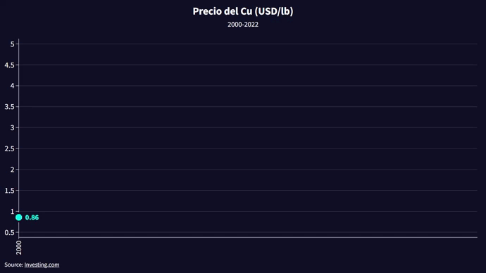

 

# Cobre - DC

Limpieza de datos para realizar la animacion del comportamiento del precio del cobre desde el ***01/01/2000*** hasta ***31/12/2022***

## Source

[CuPrice](https://es.investing.com/commodities/copper)

## Authors

- [Jinder2050](https://www.github.com/Jinder2050)

## Animacion Demo 

Vea la animacion completa [Aquí](https://www.linkedin.com/posts/yiender-condori-galdos-6a536020b_python-datavisualization-cobre-activity-7020208124884045824-vJbM?utm_source=share&utm_medium=member_desktop)

***Agradecemos cualquier retroalimentación o sugerencias.***

## 🔗 Social

        
        
        
        

 

